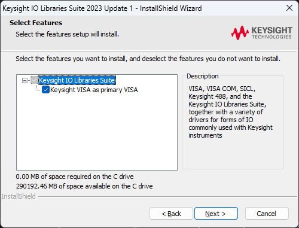

# lems-anechoic
LEMS anechoic chamber test scripts

> [!IMPORTANT]  
> Remember, CUI/ITAR/etc. data (including code/config files/design docs) does not belong on GitHub at all.

### Provenance

Code for `terminal.py` and `controller.py` originally written by Jody Caudill. No documentation of this code exists.

### Installation (in progress)
```
# VENV
uv venv --python 3.10 --seed
.venv\Scripts\activate

# PYVISA
# uv add pyvisa

# Install NI-VISA from https://www.ni.com/en/support/downloads/drivers/download.ni-visa.html
# DONE MANUALLY
# Possible that this is not even necessary?

# Hook up power meter
# DONE MANUALLY

# python mayo.py
# Prints `resources=['ASRL1::INSTR', 'ASRL2::INSTR', 'ASRL10::INSTR']`
# but does not connect to any of those three

# Download Keysight Instrument Control Bundle Download 
# https://www.keysight.com/us/en/lib/software-detail/computer-software/keysight-instrument-control-bundle-download-1184883.html
# MANUAL

# Run, select "IO Libraries"
# MANUAL

# Reboot PC
# MANUAL


# !IMPORTANT!
# When installing "Keysight Instrument Control Bundle", MUST do "Keysight VISA as primary VISA"
# Screenshot below

```


When installing "Keysight Instrument Control Bundle", MUST do "Keysight VISA as primary VISA" or else discovery won't work.


