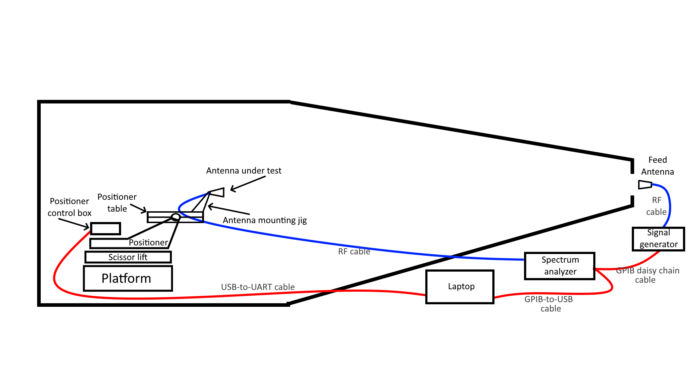
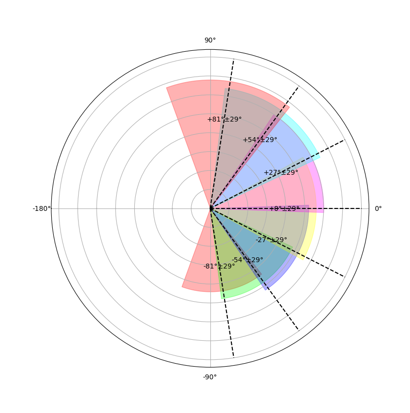
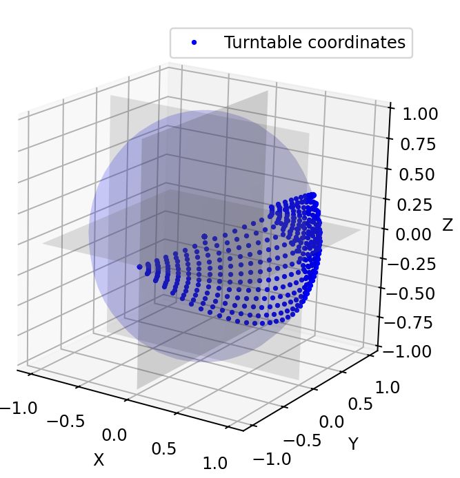
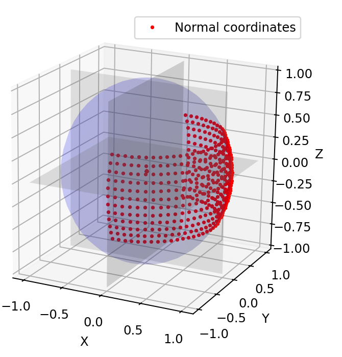

# Turntable Control

(This document written by David Mayo in March 2025.)

Here's a cartoon of the anechoic chamber as configured for characterizing an antenna. (This is a side view, and nothing is to scale.)



The "positioner" in that cartoon is a 2 axis positioner that can move in azimuth and elevation. We usually call it "the turntable," which is what this repo calls it.

## Important history

The original control system for the turntable broke at some point in the past and was replaced by a custom solution. Dr. Elijah Jensen, Tim Millhouse, and Jody Caudill were on the team that put the custom solution into place.

## How it works

The turntable is controlled by an STM32 inside the control box that directly controls the azimuth and elevation drive motors and uses some kind of timer to measure the angles of the azimuth and elevation rotations during movement. I (David Mayo) don't know anything about the mechanics/electronic/connections of all this.

> [!WARNING]  
> Be extremely careful opening the control box. The wires that connect the DB-9 connector on the lid to the STM32 board are VERY short, and they'll get ripped out very easily.

The source code for the STM32 is in a private GitHub repo called [lems-anechoic-firmware](https://github.com/msu-ssc/lems-anechoic-firmware). This code was written by Dr. Jensen.

The STM32 connects to the outside world via a DB-9 connection that uses UART with RS-232. On this port, it will output a constant stream of its internal conception of its position, in a form like `b'Pos= El: -12.34 , Az: -100.00\r\n'`. It seems to output its position every 50 milliseconds or so, although I haven't ever timed this. If the thing is powered on, it WILL spam its position nonstop. It will never output anything else. So we treat "Have I gotten a chunk of data from which I can interpret an azimuth and elevation?" as a proxy for "Am I successfully connected to the turntable?"

This stream of position is accessible with the methods `get_position` and `wait_for_position`. The difference between these is that `get_position` is faster, but it might return `None` if it receives unparsable data, but wait_for_position will sit there as long as it takes to get some data.

```python
# Might or might not get the position
position = my_turntable.get_postion()
if position:
    print(f"Successfully got position: {position}")
else:
    print(f"Failed to get position")

# Guaranteed to get the position, no matter how long it takes
position = my_turntable.wait_for_position()
print(f"Successfully got position: {position}")
```

There are three commands that can be sent to the device. All of them are simple ASCII strings sent over the UART interface.

### 1. Set command

When powered off, the turntable will forget its position. And when it's turned on, it will think it's pointed at some random angle, so you have to manually tell it where it's pointed, and you can ONLY ever tell it that it is at azimuth=0, elevation=0.

> [!WARNING]  
> The command will accept (and require) that you give an azimuth and elevation value, but the firmware on the STM-32 WILL IGNORE THESE VALUES and will use zeroes instead! So the Python code will reject any set command that has any non-zero value.

This command over the wire looks a lot like the MOVE command. The following will tell the turntable "The position that you are currently pointed in, consider that to be +0° azimuth and +0° elevation.": `b'CMD:SET:0.000,0.000;'`

Within this repo, this is handled by the method `send_set_command`. This method does a few things. It makes sure you are connected to the turntable, then it sends the set command, then it waits until it receives confirmation that the table's reported position matches the position that you just commanded to it.

```python
# Set the turntable's current position to be +0° azimuth and +0° elevation.
my_turntable.send_set_command(azimuth=0, elevation=0)
```

Alternately, you can handle this interactively by using the method `interactively_center`, which will walk you through some prompts to move the table around until you are happy with its alignment.

```python
# Follow on-screen prompts to align the table how you want it.
my_turntable.interactively_center()
```

### 2. Move command

Tell the turntable to go to some other location. The command that gets sent over UART looks like `b'CMD:MOV:20.000,-10.000;'`.

Within this library's code, this is usually handled by the `move_to` method. This sends the command to move, then waits until the turntable gets to that position. Note that the code will reject the command unless a `SET` command has already been sent.

```python
# Command the turntable to move to +20° azimuth and -10° elevation
my_turntable.move_to(azimuth=20, elevation=-10)
```

### 3. Stop command

There is a stop command. This will command the turntable to immediately stop any movement. It is safe to do this at any time. The command is just the ASCII character `'p'`, which in Python world is `b'p'`

The method to do this is `send_stop_command`, which by default will spam that command 5 times in a 1 second period.

```python
# Send stop command
my_turntable.send_stop_command()
```

This is not a very robust way to stop the table, since movement is (usually) commanded via the `move_to` method, which is a blocking process. But it could make sense in an exception block, like this:

```python
try:
    # Taken together, these four commands will pass validation, but will
    # attempt to move the table DOWN 160°, which will send it past its limits,
    # no matter what the elevation really is at the beginning.
    my_turntable.send_set_command(azimuth=0, elevation=0)
    my_turntable.move_to(azimuth=0, elevation=-80)
    my_turntable.send_set_command(azimuth=0, elevation=0)
    my_turntable.move_to(azimuth=0, elevation=-80)
except KeyboardInterrupt:
    print("You hit CTRL-C. Stopping the turntable.")
    my_turntable.send_stop_command()
```

The problem with this approach is that it won't work super well. Once you call the `move_to` method, a lot of the time in the program's execution is spent reading the data from the UART cable (with the `PySerial` package), and you can't CTRL-C your way out of that. So you'll have to spam the CTRL-C to actually raise a KeyboardInterrupt exception that will be seen by your code to trigger that `STOP` command.

The best way to stop movement is still to unplug the turntable.

## A full example

Here's some code:

```python
# Import the class
from msu_anechoic.turn_table import Turntable

# Make an instance to deal with
my_turntable = Turntable(port="COM5")

# Put all the movement code into this `try...except...` code
# so that it will send a stop command at the end if anything bad happens
try:

    # Let the program walk you through a centering process
    # This will automatically handle sending a SET command.
    my_turntable.interactively_center()

    # Move the turntable somewhere.
    my_turntable.move(azimuth=+30, elevation=+15)

    # Move the turntable somewhere else.
    # This is in a different "elevation regime",
    # so it will have to go through the process outlined below.
    my_turntable.move(azimuth=-40, elevation=-50)

    # Get the current position
    position = my_turntable.wait_for_position()
    print(f"The table is at position {position}")

    # Send an invalid command that will fail validation
    my_turntable.move(azimuth=0, elevation=+999)

# If there are any exceptions, OR any CTRL-C, this next block will run:
except (Exception, KeyboardInterrupt) as exc:
    print(f"Something bad happened: {exc}")
    print(f"Stopping the turntable.")

    # Send the stop command.
    my_turntable.send_stop_command()
```

## Turntable limits/quirks

### Elevation limits

> [!CAUTION]  
> DO NOT DRIVE the turntable outside of its elevation limits! It WILL break itself! YOU HAVE BEEN WARNED!!

The elevation is limited to the range -90° to +45° by the physical design of the device. If driven much past those limits, it WILL break, and it WILL NOT be my fault. It will be YOUR fault. I hope you're proud of yourself.

The control box DOES NOT have any way of detecting the turntable's actual elevation and WILL NOT do anything to prevent itself from tearing itself apart, if that's what you tell it to do.

There is some validation of the commanded movement. A move is only valid if you have already sent a `SET` command AND the destination is within the physical limits of the table. If a move is not valid, it will NOT be sent over the UART. But this validation is not perfect.

Here's how you will tell the turntable to destroy itself. Don't say I didn't warn you:

If you gave an inaccurate value to the `SET` command, then a seemingly valid move can be outside the limits. If the table is actually tilted at an elevation of +35°, but you mistakenly sent a `SET` command for elevation 0°, then the command "Move to elevation +30°" would pass validation and be sent to the turntable, which will start tilting up 30 more degrees. At this point, the turntable is doomed, unless someone is watching and kills the power.

### Elevation regimes

This is an implementation thing that users of this code don't need to know or care about. This is only relevant if you want to understand the code in `turn_table.py`, which is full of references to "elevation regimes."

The physical device inside the turntable that keeps track of the elevation rotation can't properly handle angles outside that range (-30°, +30°). If the turntable is commanded to go BELOW -30°, that will work fine. Then, when commanded to go BACK ABOVE -30°, as soon as it hits -30°, its internal understanding of its elevation will underflow and silently reset itself to -90° (i.e., it will be wrong by 60°), which will ultimately lead the thing to tilt up infinitely, which would destroy the turntable.

So how can we move to, say, -40°? We do it by moving the turntable to elevation -27°, then giving it a `SET` command telling it that its elevation is 0°, then moving the elevation to -13°. I handle this in the code with what I call "elevation regimes." The basic idea is to break up the whole elevation space [-90°, 90°] into seven sectors, each of which has some central angle (which is 27° from its neighbors) and is 58° wide. These numbers are chosen so that when the turntable moves to the central angle and sets itself to 0°, it can move to any other elevation within the regime without triggering the underflow thing.

Maybe this will be clearer if you see them in a graph:



So before making any move, the turntable will determine what regime it's currently in, and whether it needs to move to a different regime to do the move. If it DOES need to change regimes, it will move to the center point of the regime, tell the turntable to set itself to 0° elevation, and update its stored offset between actual elevation and the elevation that the table thinks it's at, which is called "within-regime elevation."

Anyway, this is all abstracted away from the user.

### Coordinate systems

The turntable calls its rotation angles "azimuth" and "elevation." This is very misleading, and is not precisely the same as using azimuth and elevation as spherical coordinates. We probably should have called the turntable's angles "pan" and "tilt" or something, but we called them what we did, and it's too late to change them. The problem is that there are two coordinate systems: normal spherical coordinates and turntable spherical coordinates.

In normal spherical coordinates, you move in azimuth first, then move directly up or down in elevation. So if you are facing 0°, and I told you to point at azimuth=90° and elevation=90°, you would move your arm 90° to the right (azimuth), then 90° up (elevation), and you'd end up pointing straight up.

But in the turntable coordinates, you move in elevation first, and then for azimuth, you move around this newly defined axis that has been defined by your elevation change. So if you are facing 0°, and I told you to point at azimuth=90° and elevation=90°, you would move your hand up 90° up (elevation) and then then move 90° to the right (azimuth), and you'd end up pointing straight to the right. This is a different point than when you were using spherical coordinates, even though the numbers were the same, because it's a different coordinate system.

Here’s the same grid of points (azimuth -90° to azimuth +90° and from elevation -30° to elevation +30°) in both “turntable coordinates” and in normal spherical coordinates:



